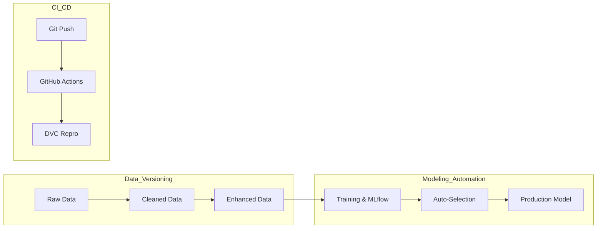

# Project Review: MLops-churn-project

## 1. Executive Summary

This project demonstrates a production-grade MLOps pipeline for Telecom Churn prediction. By integrating **Git, DVC, MLflow, and GitHub Actions**, the system ensures reproducibility, experiment tracking, and automated model selection and registration.

---

## 2. Technical Architecture & Workflow

The pipeline follows a modular "Data-as-Code" flux, where every stage is a versioned dependency.

---

## 3. Data Engineering & Versioning Strategy

We implemented a multi-stage data evolution tracked exclusively by **DVC**.

### Versioning Breakdown:

- **V1 (Raw)**: `data/raw/telecom_churn.csv` — raw source.
- **V2 (Cleaned)**: `data/interim/cleaned_churn.csv` — type fixes, `TotalCharges` conversion, numeric/categorical imputation, binary mapping.
- **V3 (Enhanced)**: `data/processed/final_churn.csv` — features like `TenureBucket`, `AvgChargesPerMonth`, and class balancing for `Churn`.

---

## 4. Modeling & Performance Analysis

We evaluated two distinct classification strategies, logging all metadata into **MLflow**.

### Results Comparison

| Model               | Accuracy | F1-Score |
| :------------------ | :------- | :------- |
| Logistic Regression | 0.7553   | 0.7498   |
| Random Forest       | 0.9754   | 0.9750   |

### Critical Insight:

The Random Forest performed best for this dataset (F1 ~0.975). This is likely due to its ability to capture non-linear relationships in engineered features such as `AvgChargesPerMonth` and `TenureBucket`. Consult MLflow for per-run details and additional comparisons.

---

## 5. Advanced MLOps Functionality

### Automated Model Lifecycle Management

We removed the human bottleneck in model deployment by implementing a **Model Selection Script**.

- **Logic**: Post-training, the system queries the MLflow tracking server.
- **Criteria**: Ranks models by F1-score.
- **Action**: Automatically registers the best model and promotes it to the **"Production"** stage in the MLflow Model Registry.

---

## 6. Automation & CI/CD

- **DVC repro**: A single command (`python -m dvc repro`) triggers the entire end-to-end pipeline, from raw data to model registration.
- **GitHub Actions**: Every code push triggers a CI pipeline that validates the reproducibility of the entire stack on an Ubuntu runner.

---

## 7. Conclusion

This pipeline successfully moves past single-script ML development into a **governed production environment**. By decoupling data from code while maintaining strong versioning links, the system is stable, scalable, and audit-ready.
