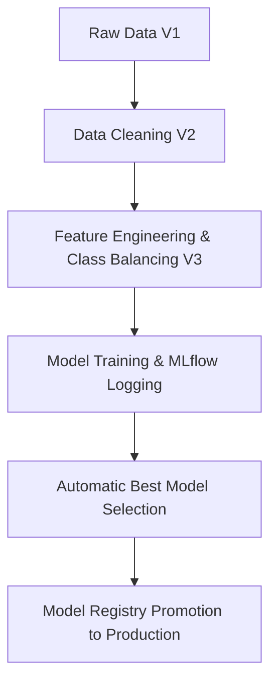

# MLops-churn-project

This repository contains a production-grade MLOps pipeline for a Telecom Churn dataset. It demonstrates data versioning, experiment tracking, pipeline automation, and CI/CD for churn prediction using tools like **DVC**, **MLflow**, and **GitHub Actions**.

## 1. Toolchain Description

- **Git**: Version control for code and configuration.
- **DVC (Data Version Control)**: Tracks dataset versions (V1, V2, V3) and orchestrates the pipeline stages.
- **MLflow**: Tracks experiment metrics, parameters, and manages the **Model Registry**.
- **GitHub Actions**: Automates the CI/CD pipeline, running the full DVC reproduction on every push.
- **Python / Scikit-Learn**: Core machine learning framework for data processing and modeling.

## 2. MLOps Workflow (The Flux)

The pipeline is structured into discrete, reproducible stages managed by DVC:



**Data Tracking Mechanisms:**

- **Raw Data**: Tracked as `data/raw/telecom_churn.csv` (use `dvc add data/raw/telecom_churn.csv` to track it).
- **Pipeline Outputs**: Tracked via `dvc.lock`. This file contains the hashes of generated datasets (e.g., `data/interim/cleaned_churn.csv`, `data/processed/final_churn.csv`).

1.  **Stage: clean_data**: Processes `data/raw/telecom_churn.csv`. Key steps: drop `customerID`, convert `TotalCharges` to numeric and impute, fill numeric and categorical nulls, convert Yes/No fields to binary, and label-encode remaining categorical fields.
2.  **Stage: feature_engineering**: Produces features tailored to churn: `TenureBucket` (tenure groups), `AvgChargesPerMonth` (TotalCharges / tenure), and applies **class balancing** (oversampling the churn minority class when needed).
3.  **Stage: training**: Trains multiple models (Logistic Regression, Random Forest). Logs metrics (Accuracy, Precision, Recall, F1) and model artifacts to MLflow.
4.  **Stage: registration**: Selects the best run by F1-score, registers the model in MLflow, and promotes it to Production (if desired).

## 3. Dataset Versions

- **V1 (Raw)**: `data/raw/telecom_churn.csv` — untouched source dataset.
- **V2 (Cleaned)**: `data/interim/cleaned_churn.csv` — type fixes (e.g., `TotalCharges`), missing-value imputation, label/binary encoding.
- **V3 (Enhanced)**: `data/processed/final_churn.csv` — engineered features (tenure buckets, average charges per month) and class balancing.

## 4. Results & Analysis

We log all training runs to MLflow; view the MLflow UI for detailed metrics per run. Example metrics from a recent pipeline execution on the supplied dataset:

| Model               | Accuracy | F1-Score |
| :------------------ | :------- | :------- |
| Logistic Regression | 0.7553   | 0.7498  |
| Random Forest       | 0.9754   | 0.9750  |

**Insight:** The Random Forest performed best on this dataset (F1 ~0.975). Results may vary with different data splits and additional feature engineering; consult the MLflow runs for precise comparisons.

## 5. Automation & CI/CD

### DVC Pipeline

Run the entire pipeline with a single command:

```bash
python -m dvc repro
```

### GitHub Actions

The `.github/workflows/mlops.yml` file ensures that every code change is validated. It:

1.  Installs dependencies from `requirements.txt`.
2.  Initializes a temporary DVC environment.
3.  Runs `python -m dvc repro` to verify that the code, data, and models are in sync.

## 6. How to Run Locally

1.  Clone the repository.
2.  Install dependencies: `pip install -r requirements.txt`.
3.  Run the pipeline: `python -m dvc repro`.
4. Run tests: `pytest -q`.
5. View results in MLflow: `python -m mlflow ui`.
